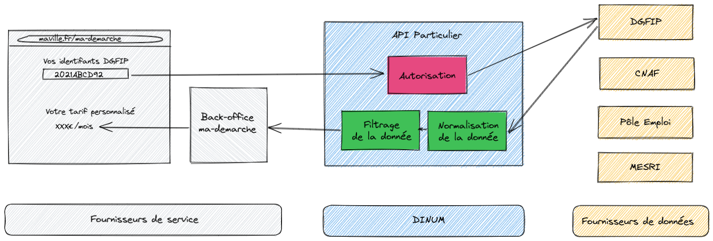

# Ce code n'est plus d'actualité, la stack a été rappatriée sur celle de API Entreprise

------


[](https://codeclimate.com/github/betagouv/api-particulier-monolith/maintainability)
[](https://codeclimate.com/github/betagouv/api-particulier-monolith/test_coverage)

# Installation

## Prérequis

- [Docker](https://www.docker.com/community-edition)
- [Docker Compose](https://docs.docker.com/compose/install/)
- [Node.js](https://nodejs.org/en/)

## Étapes

- Ajouter `127.0.0.1 mon.portail.local` dans votre fichier `/etc/hosts`
- `cp .env.dist .env`
- Demander à un collègue ou ami les valeurs des secrets à mettre en variable d'environnement
- `docker-compose up`

> Attention, l'installation peut échouer si vous ne définissez pas correctement le `.env`, par exemple la commande de migration ne saura pas se connecter à la base de données

Une fois les containers lancés, vous pouvez préparer votre environnement de développement local en lançant les commandes suivantes sur votre machine hôte :

- `npm install`
- `npm run migrate up`
- `npm run fixtures:load`

## Installations alternatives

### Sur Github Codespace

Le projet est configuré pour être développé dans un [devcontainer](https://code.visualstudio.com/docs/remote/containers), et donc par extension fonctionne dans [Github Codespace](https://github.com/features/codespaces).

Nous supposons que vous utilisez [VSCode](https://code.visualstudio.com/) en tant qu'IDE pour exploiter la capacité Codespace du projet.

[Github Codespace](https://github.com/features/codespaces) se base sur les devcontainers, si vous êtes utilisateur de Github Codespace vous pouvez tout simplement créer un codespace pour le projet en allant sur [sa page Github](https://github.com/betagouv/api-particulier) et en appuyant sur `.`.

## Configuration

Toute la configuration se fait par variable d'environnement, selon les recommandations de [Twelve-factor app](https://12factor.net/fr/).

Si vous avez choisir l'installation par Docker compose, vous n'avez rien à configurer.

Parmi les variables d'environnement notables, si vous n'avez pas choisi le mode d'installation par docker-compose, vous serez amené à modifier :

- `DATABASE_URL`
- `TEST_DATABASE_URL`

## Vérifier l'installation

Afin de vous assurer que vous êtes prêts à développer sur le projet, vous pouvez lancer les tests suivants depuis votre machine hôte :

- `npm run type-check`
- `npm test`
- `npm run test:integration`

Si vous êtes utilisateur de VSCode, vous pouvez également utiliser l'extension [REST Client](https://marketplace.visualstudio.com/items?itemName=humao.rest-client) afin d'exploiter le fichier `api.http` présent à la racine du projet.

Ce fichier recense tous les appels usuels à l'API qui vous seront utiles pour tester vos développements en local et en recette.

# Développement

## Bac à sable ou appels aux fournisseurs de donnée ?

L'API possède deux modes de fonctionnement, choisis selon la variable d'env `SANDBOXED` :

- `SANDBOXED=true` : mode bac à sable, l'API n'appelle pas les fournisseurs de donnée et se base sur les données Airtable
- `SANDBOXED=false` : mode réel, l'API appelle les fournisseurs de donnée

## Lancement de l'application

L'application possède deux couches de présentation principales :

- l'API et le backend, lancés par la commande `npm run start:dev:backend`
- le frontend, sous la forme du portail développeur, lancé par la commande `npm run start:dev:frontend`

Afin de lancer les deux couches de présentation en mode développement, exécutez la commande suivante sur votre machine hôte :

- `npm run start:dev`

Une fois l'application démarrée, vous pouvez vous rendre sur [https://mon.portail.local:3000](https://mon.portail.local:3000) afin de récupérer votre jeton d'API.

# Tests

L'application possède 4 niveaux de test :

- `npm run type-check` : analyse statique de types
- `npm test` : tests unitaires
- `npm run test:integration` : tests d'intégration
- `npm run test:end-to-end` : tests end-to-end, lancés principalement sur la [CI](https://github.com/betagouv/api-particulier/actions)

# Déploiement

L'application est exécutée sur [Dokku](), le déploiement se fait par des git push sur les bons remotes.

Un remote correspond à un environment, vous devez donc les ajouter à votre repo local pour pouvoir ensuite déployer :

- `git remote add sandbox-staging dokku@staging.particulier-infra.api.gouv.fr:particulier-test-staging.api.gouv.fr`
- `git remote add sandbox-production dokku@production.particulier-infra.api.gouv.fr:particulier-test.api.gouv.fr`
- `git remote add staging dokku@staging.particulier-infra.api.gouv.fr:particulier-staging.api.gouv.fr`
- `git remote add production dokku@production.particulier-infra.api.gouv.fr:particulier.api.gouv.fr`

Vous pouvez alors déployer sur les différents environnements :

- [Bac à sable de staging](https://particulier-test-staging.api.gouv.fr) : `git push sandbox-staging`
- [Bac à sable de production](https://particulier-test.api.gouv.fr) : `git push sandbox-production`
- [API de staging](https://particulier-staging.api.gouv.fr) : `git push staging`
- [API de production](https://particulier.api.gouv.fr) : `git push production`

# Administration

[Forest Admin](https://www.forestadmin.com/) est utilisé pour gérer les fournisseurs de services dans l'API Particulier.
[Créez-vous un compte](https://app.forestadmin.com/signup) afin de pouvoir accéder à l'interface, puis demandez à un collègue ou ami de vous inviter sur l'interface d'administration.

## Mettre à jour le schéma ForestAdmin suite à une migration de base de données

- `npx -p forest-cli forest schema:update --config=src/presentation/admin/config/databases.js --outputDirectory=src/presentation/admin2`
- `cp -R src/presentation/admin2/* src/presentation/admin/`
- `npx eslint --fix src/presentation/admin`
- manually fix the remaining linting issues
- `rm -rf src/presentation/admin2`
- `npm run start:dev:backend` to update the `.forestadmin-schema.json` file

# Fonctionnement



# Tâches de run

Certaines tâches interviennent fréquemment dans le run du produit, lorsqu'elles deviennent trop fréquentes, il convient de s'outiller.

## Envoyer les flux XML à la CNAF pour débugage de leur API

La CNAF nous demande fréquemment le contenu des flux XML d'échange avec leur API, pour certains identifiants.
Cette tâche est outillée par une CLI :

```bash
npm run cnaf:debug -- -a numeroAllocataire -c codePostal
```
